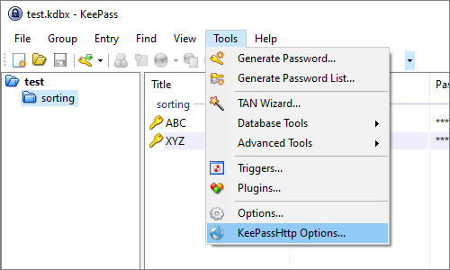

# Configuration and Options

KeePassHttp works out-of-the-box. You don't have to explicitely configure it.

 * KeePassHttp stores shared AES encryption keys in "KeePassHttp Settings" in the root group of a password database.
 * Password entries saved by KeePassHttp are stored in a new group named "KeePassHttp Passwords" within the password database.
 * Remembered Allow/Deny settings are stored as JSON in custom string fields within the individual password entry in the database.

## Settings in KeePassHttp options.

You can open the options dialog with menu: Tools > KeePassHttp Options

## General tab

### Interface:

#### 🔳 Show a notification when credentials are requested
  > show a notification balloon whenever entries are delivered to the inquirer.
  >
  > default: `enabled`

#### 🔲 Request for unlocking the database if it is locked
  > if the active database in KeePass is locked, KeePassHttp sends a request to unlock the database. Now KeePass opens and the user has to enter the master password to unlock the database. Otherwise KeePassHttp tells the inquirer that the database is closed.
  >
  > default: `disabled`

### Results:

#### 🔲 Return only best matching entries for an URL instead of all entries for the whole domain

  > returns only the best matching entries for the given url, otherwise all entries for a domain are send.
  >
  > e.g. of two entries with the URLs http://example.org and http://example.org/, only the second one will returned if the requested URL is http://example.org/index.html
  >
  > default: `disabled`

#### 🔲 Don't return expired entries
  > expired entries are not returned to the inquirer.
  >
  > default: `disabled`

#### 🔲 Match URL schemes

  > KeePassHttp returns only these entries which match the scheme of the given URL.
  >
  > given URL: `https://example.org` --> scheme: `https://` --> only entries whose URL starts with `https://`
  >
  > default: `disabled`

### Sorting:

#### ⚫ Sort found entries by title

#### ⚪ Sort found entries by username

  > sort found entries by username or title.
  >
  > default: `by title`

### Cleanup:

#### **[Remove all shared encryption-keys from active database]**

  > removes all shared encryption-keys which are stored in the currently selected database. Every inquirer has to reauthenticate.

#### **[Remove all stored permissions from entries in active database]**

  > removes all stored permissions in the entries of the currently selected database.

### Updates:

#### 🔳 Check KeePassHttp updates

  > Enables automatic checking for newer versions of the **KeePassHttp** plugin.
  >
  > If **disabled**, the `UpdateUrl` will point to a local KeePassHttp instance that returns the current version - hence no updates will be found.
  >
  > default: `enabled`

## Advanced tab

{: .warning }
Activate the following options only, if you know what you are doing!

#### 🔲 Always allow access to entries
  > KeePassHttp no longer asks for permissions to retrieve entries, it always allows access.
  >
  > default: `disabled`

#### 🔲 Always allow updating entries
  > KeePassHttp no longer asks for permission to update an entry, it always allows updating them.
  >
  > default: `disabled`

#### 🔲 Search in all opened databases for matching entries
  > KeePassHttp searches across all opened databases for matching URLs.
  >
  >  Searching for entries is no longer restricted to the current active database in KeePass but is extended to all opened databases!
  >
  > __Important:__ Even if another database is not connected with the inquirer, KeePassHttp will search and retrieve entries of all opened databases if the active one is connected to KeePassHttp!
  >
  > default: `disabled`

#### 🔲 Return also advanced string fields
  > if activated KeePassHttp also search for string fields which are defined in the found entries and start with "KPH: " (note the space after colon). __The string fields will be transfered to the client in alphabetical order__. You can set string fields in the tab _Advanced_ of an entry.
  >
  > default: `disabled`

#### 🔳 Only return advanced string fields which start with "KPH: "
  > works only if the option [RETURN ALSO ADVANCED STRING FIELDS](#-return-also-advanced-string-fields) is enabled.
  >
  > default: `enabled`

## Listener Configuration

#### 🔳 Activate HTTP Listener
  > KeePassHttp listens for HTTP connections configured by the **Host** and **Port** settings below.
  >
  > default: `enabled`

#### **Host:** (HTTP)
  > Defines which network interface KeePassHttp listens on for HTTP connections.
  >
  > default: `localhost`

#### **Port:** (HTTP)
  > The port used by KeePassHttp to communicate with browser extensions over HTTP.
  > If you change this value, also update it in extensions (chromeIPass, PassIFox, KeePassHTTP-Connector, etc.).
  >
  > default: `19455`

#### 🔲 Activate HTTPS Listener
  > KeePassHttp listens for HTTPS connections configured by the **Host** and **Port** settings below.
  >
  > default: `disabled`

#### **Host:** (HTTPS)
  > Defines which network interface KeePassHttp listens on for HTTPS connections.
  >
  > default: `localhost`

#### **Port:** (HTTPS)
  > The port used by KeePassHttp to communicate with browser extensions over HTTPS.
  > If you change this value, also update it in extensions (chromeIPass, PassIFox, KeePassHTTP-Connector, etc.).
  >
  > default: `19456`